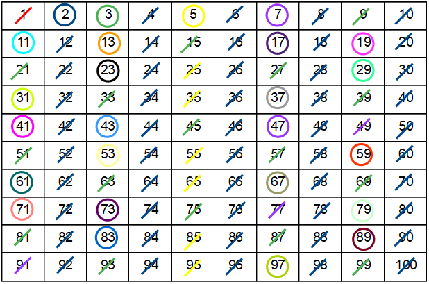
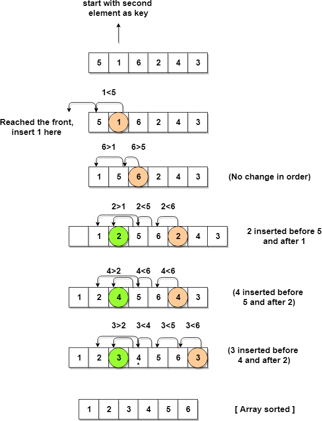

# Utilized algorithms
## Matrix Multiplication

## Gaussian Elimination

## Dijkstra

## Sieve of Eratosthenes

## Bubble sort

## Bucket sort

## Counting Sort

## Insertion Sort

## Selection Sort

## Quick Sort
