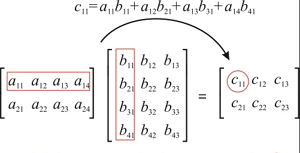
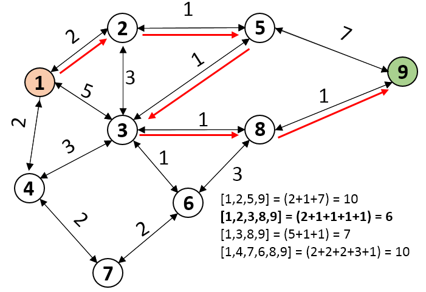
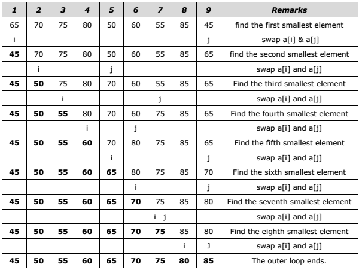

# Performance Analytics
Measuring time for different algorithms implemented in C.

# Matrix Multiplication

# Gaussian Elimination

# Dijkstra

# Sieve of Eratosthenes

# Bubble sort

# Bucket sort

# Counting Sort

# Insertion Sort

# Selection Sort

# Quick Sort
